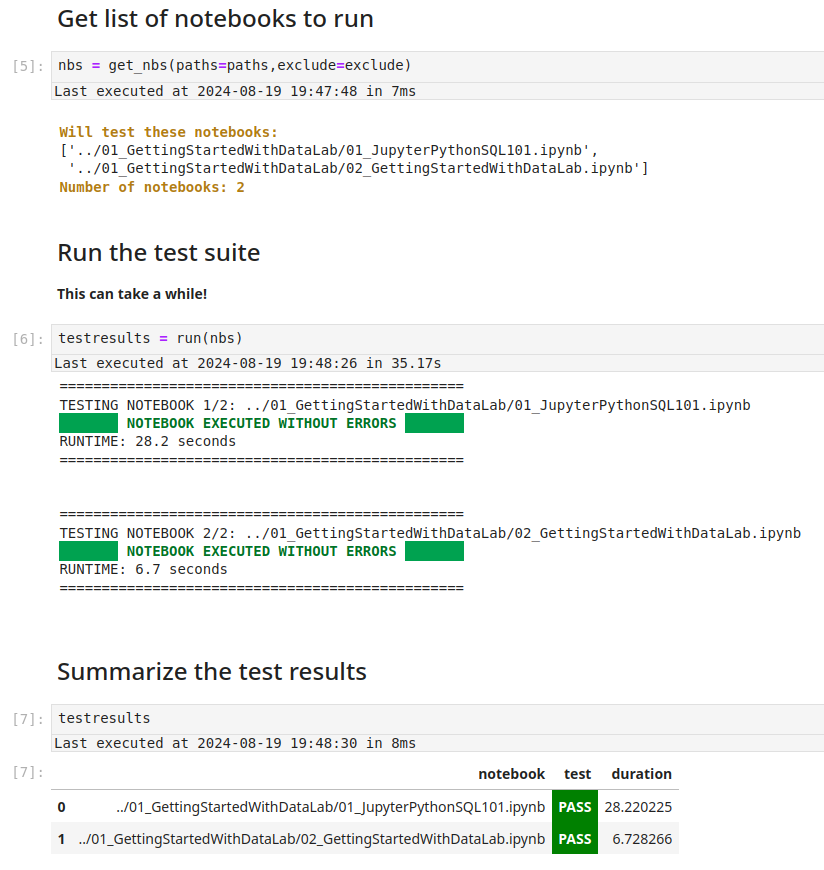

*Version:* 20240816 | *Author:* Robert Nikutta \<robert.nikutta@noirlab.edu\>


# Automatically test notebooks

  * [Synopsis](#synopsis)
  * [Preview](#preview)
  * [Steps: On the  Data Lab Jupyter notebook server](#steps-on-the-data-lab-jupyter-notebook-server)
  * [Steps: On your local Jupyter / JupyterLab or in the terminal](#steps-on-your-local-jupyter--jupyterlab-or-in-the-terminal)

## Synopsis
Run `testnotebooks.ipynb` to test a collection of other notebooks for runtime failures, e.g. the set of default Data Lab notebooks.

## Preview



## Steps: On the Data Lab Jupyter notebook server

1. Get a fresh copy of `notebooks-latest/`:

  * Open a terminal (New-->Terminal)
  * Type: `getlatest foobar` (or any other name for a target directory)

2. In the Jupyter dashboard

  * Navigate to the new `foobar/tests/` sub-folder
  * Click on `testnotebooks.ipynb` to open the testing notebook

4. Run the cells in order from top to bottom.

  * Log in once.
  
  * If you want to test **all** notebooks, leave the `paths` variable as is. Note that a full test will take 20-30 minutes.
  Otherwise adjust `paths` as shown in the comment in that cell.

  * If you are OK with the defaults, leave the `exclude` variable as-is **(recommended)**.
  Otherwise, you can adjust it as shown in the comment in that cell, to exclude additional directories or notebooks from testing.

4. The notebooks will be tested one by one, with the test status printed in <span style="color:green">**green**</span> if a notebooks runs error-free, and <span style="color:red">**red**</span> if not. For failed notebooks, the tracelog will be printed out as well.

5. When all tests have finished, the final cell summarizes the test suite, with simple <span style="color:green">**PASS**</span> / <span style="color:red">**FAIL**</span> flags for each tested notebooks.

6. <span style="color:red">**FAIL**</span>-ed (red) notebooks should of course by fixed, and a PR made on Github.


## Steps: On your local Jupyter / JupyterLab or in the terminal

1. Make sure you have the Data Lab command line installed:

  `pip install --ignore-installed --no-cache-dir astro-datalab`

2. Get a fresh copy of `notebooks-latest/` to a local target directory:

  ```mkdir foobar/
     cd foobar
     git clone https://github.com/astro-datalab/notebooks-latest.git
     cd notebooks-latest/tests/
  ```

3. If running a local Jupyter / JupyterLab:

  * In the dashboard navigate to `notebooks-latest/tests/`
  * Click on `testnotebooks.ipynb` to open the testing notebook

  Follow the steps 4 and 5 under "Steps: On the  Data Lab Jupyter notebook server" above.

OR 

3. If running in your local terminal:

  * `cd` into `notebooks-latest/tests/`
  * Either accept the default `paths` and `exclude` variables, or adjust them by editing them towards the end of the `testnotebooks.py` file. **Note: the `.py` file, not `.ipynb`!**

  * Run the test suite via: `python ./testnotebooks.py`
  
  You will see something akin to this:
  
  
